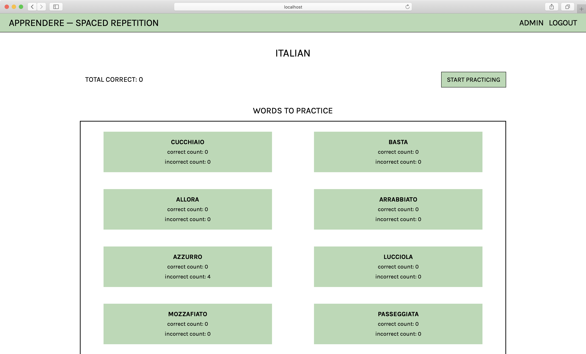
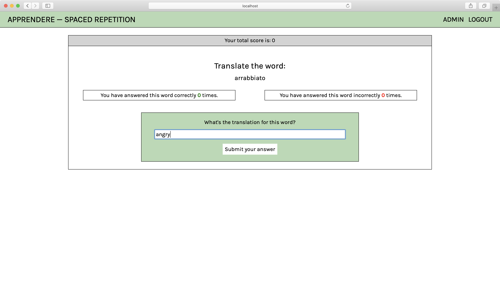
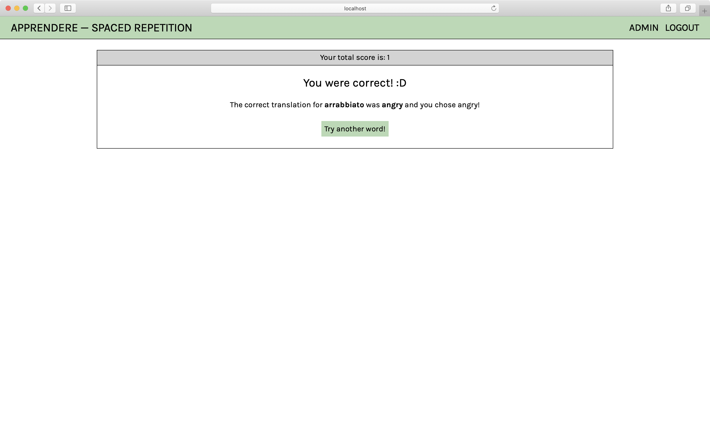

# Apprendere - Spaced Repetetion API

## Overview

Apprendere is an app which helps users learn Italian using “spaced repetition” to help memorize words in a foreign language.

This app maintains a list of Italian words in a database that also includes records of a user’s total score, each word’s correct and incorrect count, and it’s current place in memory.

## Screenshots

### Dashboard


When the front end sends a guess, our backend server utilizes an algorithm to determine if the guess was correct or incorrect. As words are guessed correctly or incorrectly, those numbers increase accordingly and the words move up or down the list.

### WordPage


User is presented with the `head` of the linkedList and gets back the numbrer of correct and incorrect guesses on that word

### Feedback


When the frontend requests the words again, the server responds with an updated list. Therefore, the user spends more time working on the words that they are having trouble with rather than the words they seem to already know.

## Local dev setup

If using user `dunder-mifflin`:

```bash
mv example.env .env
createdb -U dunder-mifflin spaced-repetition
createdb -U dunder-mifflin spaced-repetition-test
```

If your `dunder-mifflin` user has a password be sure to set it in `.env` for all appropriate fields. Or if using a different user, update appropriately.

```bash
npm install
npm run migrate
env MIGRATION_DB_NAME=spaced-repetition-test npm run migrate
```

And `npm test` should work at this point

## Configuring Postgres

For tests involving time to run properly, configure your Postgres database to run in the UTC timezone.

1. Locate the `postgresql.conf` file for your Postgres installation.
   1. E.g. for an OS X, Homebrew install: `/usr/local/var/postgres/postgresql.conf`
   2. E.g. on Windows, _maybe_: `C:\Program Files\PostgreSQL\11.2\data\postgresql.conf`
   3. E.g  on Ubuntu 18.04 probably: '/etc/postgresql/10/main/postgresql.conf'
2. Find the `timezone` line and set it to `UTC`:

```conf
# - Locale and Formatting -

datestyle = 'iso, mdy'
#intervalstyle = 'postgres'
timezone = 'UTC'
#timezone_abbreviations = 'Default'     # Select the set of available time zone
```

## Scripts

Start the application `npm start`

Start nodemon for the application `npm run dev`

Run the tests mode `npm test`

Run the migrations up `npm run migrate`

Run the migrations down `npm run migrate -- 0`
